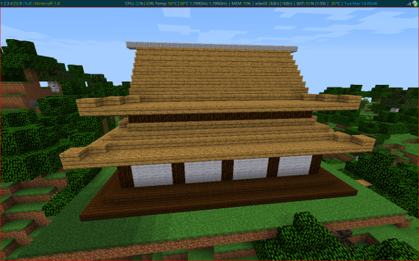

Minecraft Tools
===============

Just a collection of random tools I've written Minecraft_ and used that aren't
quite up to being their own thing. I expect this will mostly be a collection of
python programs to construct things inside Minecraft via CanaryMod_ and
CanaryRaspberryJuicePlugin_.

.. _Minecraft: http://www.minecraft.net/
.. _CanaryMod: https://canarymod.net/releases/
.. _CanaryRaspberryJuicePlugin: https://github.com/martinohanlon/CanaryRaspberryJuice/

Japanese House
--------------

japanese_house.py_ produces a Minecraft interpretation of a classice Japanese
house. Presently it only produces the single configuration that is little more
than an empty shell.

**Caveats:**

- Despite coding in the block data, all my stairs face South.
- Despite coding in the block data, no torches will stick to walls.

I'm presently unsure if this is *my* issue, or whether it lies further
upstream.

.. _japanese_house.py: https://git.mcwhirter.io/craige/minecraft-tools/blob/master/japanese_house.py

